# GUIA DE TRABAJO

## Overview
Esta guia es para poder orientar a los desarrolladores el flujo de trabajo para la integración del proyecto.
El repositorio debe mantenerse con dos ramas permanentes:
1. `main`
2. `development`

El resto de ramas deben ser temporales. Una vez que el Pull Request sea aprobado y fusionado, la rama temporal debe eliminarse tanto en remoto como en local.

## `main`
`main` es la rama de producción. Solo debe recibir cambios estables, probados y listos para presentación o despliegue final.

Reglas:
- No trabajar directamente sobre `main`.
- No subir commits directos a `main`.
- Integrar a `main` únicamente desde `development`, mediante Pull Request aprobado.
- Mantener `main` como la versión más estable del frontend.

## `development`
`development` es la rama de integración. Todo cambio nuevo debe pasar primero por esta rama antes de llegar a producción.

Reglas:
- Todas las ramas de trabajo deben crearse desde `development`.
- Todo cambio debe entrar a `development` mediante Pull Request.
- `development` debe estar protegida contra pushes directos.
- Los Pull Requests hacia `development` solo deben ser aprobados y fusionados por `@ChillLiz`.
- Después de fusionar un Pull Request, eliminar la rama temporal usada para ese cambio.

## Ramas temporales
Usar ramas temporales para features, fixes, pruebas o ajustes puntuales.

Convención recomendada:
```bash
feature/descripcion-corta
fix/descripcion-corta
hotfix/descripcion-corta
chore/descripcion-corta
```

Ejemplos:
```bash
feature/catalogo-cliente
fix/contraste-tema-cliente
hotfix/login-admin
chore/docker-compose
```

## Protección requerida en GitHub
Configurar una regla de protección para `development` con estas opciones:
- Require a pull request before merging.
- Require approvals.
- Require review from Code Owners.
- Require status checks to pass: `Frontend CI`.
- Do not allow bypassing the above settings.
- Block force pushes.
- Block deletions.

El archivo `.github/CODEOWNERS` define a `@ChillLiz` como responsable del código. Con la opción **Require review from Code Owners**, GitHub exigirá su aprobación para poder fusionar cambios en `development`.

## Integración continua
El repositorio usa GitHub Actions para validar automáticamente que el frontend compile antes de permitir que un cambio entre a una rama protegida.

El workflow se encuentra en:
```text
.github/workflows/frontend-ci.yml
```

El status check que debe quedar como obligatorio en GitHub es:
```text
Frontend CI
```

### Cuándo se ejecuta
`Frontend CI` se ejecuta automáticamente en estos casos:
- Cuando se abre o actualiza un Pull Request hacia `development`.
- Cuando se abre o actualiza un Pull Request hacia `main`.
- Cuando hay un push a `development` o `main`.

### Qué valida
El workflow valida la aplicación Next.js unificada:

| Paso | Validación |
|------|------------|
| Instalación | Ejecuta `pnpm install --frozen-lockfile`. |
| Typecheck | Ejecuta `tsc --noEmit` mediante `pnpm run lint`. |
| Build | Ejecuta `next build` mediante `pnpm run build`. |

Si cualquiera de estos pasos falla, el Pull Request no debe fusionarse hasta corregir el error.

### Cómo debe configurarse la protección de `development`
Sí, es necesario ajustar la protección de `development` para que use la integración continua.

En GitHub:
1. Ir a `Settings -> Branches` o `Settings -> Rules -> Rulesets`.
2. Editar la regla que protege `development`.
3. Activar **Require a pull request before merging**.
4. Activar **Require approvals**.
5. Activar **Require review from Code Owners**.
6. Activar **Require status checks to pass**.
7. Seleccionar el check **Frontend CI**.
8. Activar **Require branches to be up to date before merging** si aparece disponible.
9. Bloquear force pushes y eliminación de rama.
10. Guardar los cambios.

Con esta configuración, GitHub solo permitirá fusionar un Pull Request hacia `development` cuando:
- El PR tenga la aprobación requerida.
- `@ChillLiz` apruebe como Code Owner.
- El check `Frontend CI` termine en verde.
- La rama temporal esté actualizada con `development`, si se activó la opción de ramas actualizadas.

### Qué hacer si falla
Cuando `Frontend CI` falla:
1. Abrir el Pull Request.
2. Entrar al check fallido `Frontend CI`.
3. Revisar cuál paso falló: instalación, typecheck o build.
4. Corregir el error en la misma rama temporal.
5. Hacer push nuevamente para que GitHub Actions vuelva a ejecutar el workflow.

## Flujo recomendado
Todo cambio debe seguir este recorrido:
```text
development -> rama temporal -> Pull Request a development -> pruebas -> aprobación de @ChillLiz -> merge -> eliminar rama temporal
```

Cuando `development` esté estable y lista para producción:
```text
development -> Pull Request a main -> pruebas finales -> merge a main
```



## Flujo del Proceso

### 1. Creación de la rama de trabajo
```bash
git checkout development
git pull origin development
git checkout -b feature/descripcion-corta
```

### 2. Desarrollo y regular Rebasing

* El desarrollador debe trabajar en su rama temporal para el task asignado.
* Ejecutar un rebase cada día o cuando se informe que `development` fue actualizada.

```bash
git fetch origin
git rebase origin/development
```

* Crear commits constantes con mensajes claros.
```bash
git commit -m "feature: implement user authentication"
```

### 3. Push & Create Pull Request

```bash
git push origin feature/descripcion-corta
```

* Crear un Pull Request hacia `development`.
* Agregar detalles sobre lo que se hizo para ese ticket.
* Esperar aprobación de `@ChillLiz`.
* Después del merge, eliminar la rama temporal.

---

## Arquitectura del Frontend

El frontend ahora es una sola aplicación Next.js. Los módulos que antes estaban separados en varias apps se unificaron como rutas dentro del mismo proyecto.

```text
app/
  (cliente)/                 -> rutas públicas del cliente
  admin/                     -> panel administrativo
  comerciante/               -> panel del comerciante

domains/
  cliente/                   -> componentes, vistas, contexto y API del cliente
  admin/                     -> componentes, contexto y API del administrador
  comerciante/               -> componentes, contexto y API del comerciante
```

### Rutas principales

| Ruta | Módulo |
|------|--------|
| `/` | Cliente |
| `/admin` | Administración |
| `/admin/login` | Login administrativo |
| `/comerciante` | Redirección al login del comerciante |
| `/comerciante/login` | Login del comerciante |
| `/comerciante/dashboard` | Panel del comerciante |
| `/recuperacion` | Recuperación de contraseña del cliente |
| `/admin/recuperar-contrasena` | Recuperación de contraseña del administrador |
| `/comerciante/recovery` | Recuperación de contraseña del comerciante |

El frontend se despliega como un único proceso Next.js y un único contenedor Docker. Ya no se usa un gateway Express ni tres apps Next separadas.

### Variables de entorno

| Variable | Uso |
|----------|-----|
| `NEXT_PUBLIC_API_URL` | URL pública del backend usada por Cliente y Admin |
| `NEXT_PUBLIC_API_BASE_URL` | URL pública del backend usada por Comerciante |
| `NEXT_PUBLIC_STORE_LOGO_UPLOAD_MODE` | Modo de carga de logos de tienda |
| `NEXT_PUBLIC_MERCHANT_STORE_SYNC_MODE` | Modo de sincronización del módulo comerciante |

Las variables `NEXT_PUBLIC_*` quedan incluidas en el bundle del navegador durante el build. Si cambia la URL del backend, se debe reconstruir la imagen del frontend.

### Recuperación de contraseña

Los tres tipos de usuario comparten la API de recuperación ubicada en `domains/auth`. Cada pantalla solicita el correo al backend, recibe el enlace por Gmail y valida el token antes de permitir una nueva contraseña.

El frontend solo necesita que `NEXT_PUBLIC_API_URL` o `NEXT_PUBLIC_API_BASE_URL` apunte al backend. La cuenta Gmail y su contraseña de aplicación se configuran únicamente en el backend; nunca deben incluirse en variables `NEXT_PUBLIC_*`.

La nueva contraseña debe tener entre 8 y 72 caracteres e incluir mayúscula, minúscula, número y símbolo. Los enlaces caducan en 30 minutos por defecto y solo pueden utilizarse una vez.

## Despliegue con Docker

El despliegue usa un solo `Dockerfile`, una sola imagen y un solo contenedor llamado `frontend`. No se deben construir imágenes separadas para Cliente, Admin o Comerciante.

```text
Internet :80
    |
    v
kingstore-frontend :3000
    |-- /                  Cliente
    |-- /admin             Administración
    `-- /comerciante       Comerciante
             |
             v
       Backend público
```

### Requisitos

- Node.js `22` y pnpm `11.1.0` para validación local.
- Docker Engine `24` o superior en el servidor.
- Docker Compose v2.
- Backend desplegado y accesible desde el navegador.
- CORS del backend configurado para permitir el origen del frontend.

### Validar antes del despliegue

El despliegue debe hacerse desde `main` para producción. Antes de promover `development` a `main`, `Frontend CI` debe estar en verde.

```bash
pnpm install --frozen-lockfile
pnpm run lint
pnpm run build
```

### Preparar la EC2

Ejecutar una vez en Ubuntu:

```bash
sudo apt update
sudo apt install -y docker.io docker-compose-v2 git
sudo usermod -aG docker "$USER"
```

Cerrar la sesión SSH y entrar nuevamente para aplicar el grupo `docker`.

Clonar el repositorio y seleccionar la rama de producción:

```bash
git clone git@github.com:IngeSoft-Grupo02/Frontend.git
cd Frontend
git switch main
git pull --ff-only origin main
```

### Configurar variables

Crear un archivo `.env` junto al `docker-compose.yml`:

```bash
NEXT_PUBLIC_API_URL=https://api.example.com
NEXT_PUBLIC_API_BASE_URL=https://api.example.com
NEXT_PUBLIC_STORE_LOGO_UPLOAD_MODE=local
NEXT_PUBLIC_MERCHANT_STORE_SYNC_MODE=local
```

Consideraciones:

- La URL debe ser pública y alcanzable desde el navegador del usuario.
- No usar `localhost:8080` en AWS: apuntaría al computador del usuario, no a la EC2.
- Si el backend usa la IP pública de la EC2, se puede usar `http://IP_PUBLICA:8080`.
- Las variables `NEXT_PUBLIC_*` se incorporan durante `docker compose build`. Cambiarlas exige reconstruir la imagen.
- Este `.env` no debe contener contraseñas del backend ni secretos privados.

### Primer despliegue

```bash
docker compose up -d --build
docker compose ps
```

El servicio resultante es:

| Servicio | Puerto externo | Puerto interno |
|----------|----------------|----------------|
| `frontend` | `80` | `3000` |

### Verificar el despliegue

```bash
curl -I http://IP_PUBLICA/
curl -I http://IP_PUBLICA/admin
curl -I http://IP_PUBLICA/comerciante/login
docker compose logs --tail=100 frontend
```

Las tres rutas deben responder `HTTP 200`. También se debe probar desde el navegador el login de Admin y Comerciante para confirmar conexión con el backend.

### Publicar una actualización

Después de fusionar cambios aprobados en `main`:

```bash
cd Frontend
git switch main
git pull --ff-only origin main
docker compose build --pull frontend
docker compose up -d frontend
docker compose ps
docker compose logs --tail=100 frontend
```

La reconstrucción es obligatoria cuando cambian variables `NEXT_PUBLIC_*`.

### Despliegue continuo con GitHub Actions

El workflow `.github/workflows/frontend-cd.yml` despliega automáticamente después de cada push aceptado en `main`. Los Pull Requests hacia `development` y `main` continúan siendo validados primero por `Frontend CI`.

El despliegue construye una imagen inmutable identificada por el SHA del commit, la transfiere a EC2 y actualiza el servicio definido en `docker-compose.production.yml`. No es necesario clonar el repositorio ni compilar el frontend dentro de EC2.

Crear un environment de GitHub llamado `production` y configurar estos secrets:

| Secret | Valor |
|--------|-------|
| `EC2_HOST` | DNS o IP pública de EC2, sin `http://` |
| `EC2_USER` | Usuario SSH, normalmente `ubuntu` |
| `EC2_SSH_KEY` | Contenido completo de la clave privada de despliegue |
| `EC2_KNOWN_HOSTS` | Entrada verificada de `known_hosts` para la instancia |

Configurar estas variables del environment:

| Variable | Valor recomendado |
|----------|-------------------|
| `NEXT_PUBLIC_API_URL` | `http://52.205.138.95:8080` |
| `NEXT_PUBLIC_API_BASE_URL` | `http://52.205.138.95:8080` |
| `NEXT_PUBLIC_STORE_LOGO_UPLOAD_MODE` | `local` |
| `NEXT_PUBLIC_MERCHANT_STORE_SYNC_MODE` | `local` |

En `production`, activar **Required reviewers** para que el despliegue necesite aprobación manual después del merge a `main`. La clave privada nunca debe guardarse en el repositorio, archivos versionados, comentarios, issues o conversaciones.

Preparación única del servidor:

```bash
sudo apt update
sudo apt install -y docker.io docker-compose-v2
sudo usermod -aG docker ubuntu
mkdir -p ~/kingstore/frontend
```

Después de volver a iniciar sesión, comprobar que `docker ps` funcione sin `sudo` y que el puerto `80` esté libre. El primer workflow puede ejecutarse manualmente desde `Actions -> Frontend CD -> Run workflow`; los siguientes despliegues se ejecutan al actualizar `main`.

### Logs y mantenimiento

```bash
docker compose logs -f frontend
docker compose restart frontend
docker compose down
```

### Rollback básico

Si una versión falla, regresar al commit anterior estable y reconstruir:

```bash
git log --oneline -10
git switch --detach COMMIT_ESTABLE
docker compose up -d --build frontend
```

Después de resolver el incidente, volver a `main`:

```bash
git switch main
git pull --ff-only origin main
```

### Security Group de AWS

Asegúrate de permitir:

- HTTP -> puerto `80` -> origen `0.0.0.0/0`
- SSH -> puerto `22` -> origen: tu IP
- Puerto del backend, por ejemplo `8080`, solo si la API se expone directamente.

Para producción real se recomienda HTTPS en el frontend y backend. Si el frontend usa HTTPS, la API también debe usar HTTPS para evitar bloqueo por contenido mixto del navegador.

### Diagnóstico rápido

| Problema | Revisión |
|----------|----------|
| El frontend no abre | `docker compose ps` y `docker compose logs frontend` |
| Admin/Comerciante abren pero no inician sesión | URL pública del backend, CORS y estado del backend |
| Sigue usando una URL vieja | Reconstruir con `docker compose up -d --build frontend` |
| El puerto 80 no responde | Security Group de EC2 y mapeo `80:3000` |
